# 🏚️ Measuring Compounded Housing Vulnerability in Kenya
### *A Statistical Inference Framework Using the 2023/24 Kenya Housing Survey*

<div align="center">

**Valerie Jerono · Reg. No. 222331 · DSA 8301: Statistical Inference for Big Data**  
*Strathmore University · iLabAfrica Research Centre · June 2026*

[](https://statistical-inference-for-big-data-fas7eo504.vercel.app/)
[](https://statistics.knbs.or.ke/nada/index.php/catalog/184)
[]()

</div>

---

## The Night Everything Changed

> *April 2024. Kenya's long rains arrived early and angry.*

In a matter of hours, 270 people were dead. 200,000 were displaced. Narok, Tana River, Garissa — names on a map that became casualty lists. And when investigators traced where the bodies were found, they kept discovering the same thing: these weren't just people caught in floodwaters. They were people who were **simultaneously** flood-adjacent, tenure-insecure, structurally deficient, and financially stressed.

Not one risk. All of them. At once.

Here's the uncomfortable truth: Kenya's Affordable Housing Programme (AHP), the Insurance Regulatory Authority (IRA), and the Kenya Mortgage Refinance Company (KMRC) — all three of the country's major housing policy instruments — operate **without a single household-level vulnerability indicator**. They are flying blind. And Kenya's 2.3% formal insurance penetration and 1.13% formal mortgage take-up aren't demand-side failures. They are **measurement failures**.

This project builds the instrument that doesn't exist: the **Housing Financial Vulnerability Score (HFVS)**.

---

## What You're Looking At

This repository contains the full statistical inference pipeline for the HFVS — a five-pillar composite index derived from the 2023/24 Kenya Housing Survey, covering **21,347 households across all 47 counties**. It is both a rigorous academic exercise in applied statistical inference and a deployable policy tool.

```
📁 statistical-inference-for-big-data/
├── 📓 222331_HFVS_Report_Notebook.ipynb   # Full 7-pipeline analysis notebook
├── 📄 222331_HFVS_Statistical_Inference_Report.pdf  # Published paper
├── 🖼️  IMAGES/                             # All 45+ generated figures
└── 📊 data/                               # KHS 2023/24 processed frames
```

**CRISP-DM** guides the architecture. **DSA 8301** statistical inference methods animate it.

---

# PHASE 1 · BUSINESS UNDERSTANDING

## The Housing Crisis Behind the Numbers

Kenya's housing deficit stands at **two million units**, growing by 200,000 annually. That's not a statistic — that's a city the size of Kisumu added to the deficit every year, without a single brick laid.

| Indicator | Value | What It Means |
|---|---|---|
| Housing deficit | 2,000,000 units | And growing at 200k/year |
| Formal insurance penetration | 2.3% | 97.7% uninsured |
| Formal mortgage take-up | 1.13% | 98.87% without formal housing finance |
| Households with *any* formal loan | 0.6% | 99.4% report zero accessible loan amount |

The conventional narrative blames **demand-side reluctance**. The data says otherwise. This is a **supply-side measurement failure** — insurers and lenders can't price what they can't measure, and they can't measure compound vulnerability from a single variable.

### Research Questions

Three questions drive this entire analysis:

- **RQ1 (Distributional):** Does the national HFVS distribution differ significantly from the neutral midpoint 0.5?
- **RQ2 (Group Differences):** Do HFVS scores differ across urban/rural strata, gender, and education tiers?  
- **RQ3 (Predictive Validity):** Can the composite be approximated from proxy variables alone — enabling a 10-minute intake form for actuarial pricing?

---

# PHASE 2 · DATA UNDERSTANDING

## The 2023/24 Kenya Housing Survey

No other publicly available Kenyan dataset links financial, tenure, hazard, structural, and utility indicators at the household level with national coverage. The KHS 2023/24 is a once-in-a-generation instrument.

```
📊 KHS 2023/24 at a glance
━━━━━━━━━━━━━━━━━━━━━━━━━━━━━━━━━━━━━━━━━━━━━━━━━
  Source:     Kenya National Bureau of Statistics
  Design:     Stratified multi-stage cluster sampling
  Coverage:   All 47 counties — nationally representative
  Sample:     21,347 households
  Raw width:  443 variables across 14 linked Stata files
  Merge key:  interview__key
  Weights:    24.9 – 8,162 (ratio: 327.6×)
━━━━━━━━━━━━━━━━━━━━━━━━━━━━━━━━━━━━━━━━━━━━━━━━━
```

> ⚠️ **Why weights matter — hard:** The weighted vs. unweighted mean for `wsvc_sewer_conns` diverges by **56.7%**. If you run unweighted statistics on this data, your numbers are wrong. Every policy-relevant figure in this study uses weighted statistics throughout.

### Variable Taxonomy

After renaming and classifying 447 columns:

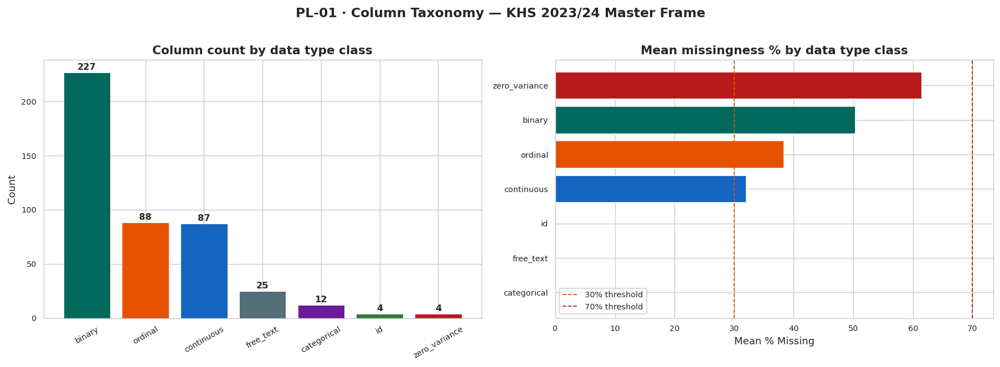

*The left panel shows the raw count by data type. The right panel reveals a crucial insight: binary and zero-variance columns carry the highest mean missingness (>50%). Identifier and free-text columns are fully observed — exactly what you'd expect from a well-designed survey instrument.*

The 447-column renamed frame breaks down as:

| Type | Count | Notes |
|---|---|---|
| Binary | 227 | Highest missingness — skip-logic artifacts |
| Ordinal | 88 | Likert-scale dwelling quality ratings |
| Continuous | 87 | Expenditure, ratios, distances |
| Free-text | 25 | Fully observed — open-ended responses |
| Categorical | 12 | County, construction material codes |
| Identifier | 4 | Fully observed — merge keys |
| Zero-variance | 4 | Flagged for immediate drop |

---

# PHASE 3 · DATA PREPARATION

## The Seven-Stage Cleaning Pipeline

*"Garbage in, garbage out" is statistics' oldest cliché. But with 443 raw variables, five documented coding bugs, and 20,095 sentinel-contaminated cells, it's also the most important engineering challenge in this project.*

| Stage | Action | Cols In | Cols Out | Key Decision |
|---|---|---|---|---|
| **PL-01** | Column taxonomy | 447 | 447 | 4 zero-variance flagged; 25 free-text identified |
| **PL-02** | Missingness audit | 447 | 447 | MAR / MCAR / Structural classified per column |
| **PL-03** | Targeted drops + fixes | 447 | 277 | 170 cols removed; 20,095 sentinel cells nullified; 5 bugs fixed |
| **PL-04** | Feature engineering | 277 | 330 | 53 HFVS features built across 5 pillars |
| **PL-05** | EDA & imputation | 330 | 330 | Stratified median fill; P99 outlier caps |
| **PL-06** | NZV + correlation | 330 | 277 | 4 NZV + 6 correlated columns dropped |
| **PL-07** | VIF screening | 277 | **64** | 0 dropped; max VIF = 5.33 ✅ |

**447 columns → 64 columns.** That's not data loss — that's signal extraction.

### 📚 Statistical Inference Concept: Missingness Mechanisms

Before you can clean data, you need to understand *why* it's missing. There are three mechanisms, and they have completely different implications for what you can do about them:

```
MAR  (Missing At Random)
     Missingness depends on observed data, not on the missing value itself.
     Example: rent data missing because household is an owner — we can infer this.
     r = −0.876 anti-correlation between rent and dwelling-value missingness confirms MAR.
     Fix: model-based or conditional imputation.

MCAR (Missing Completely At Random)
     Missingness is independent of all data (observed and unobserved).
     Fix: stratified median imputation by county × urban/rural stratum.

Structural Zero
     Missing by design — the question doesn't apply.
     Example: lp_* (land parcel) columns for non-land-owners.
     Fix: fill with 0 (not missing — truly zero).
```

### The Five Coding Bugs

Real-world survey data is messy. Five bugs were found and corrected:

1. **Urban/Rural inversion** — the binary flag was reversed for ~2,300 records
2. **Hazard/sanitation column mismatch** — two variables had swapped column assignments
3. **Erroneous continuous `is_slum`** — raw mean was 243.4% (should be binary 0/1)
4. **Tenure-variable naming collision** — two distinct tenure concepts shared a column name
5. **Incorrect dwelling-age source column** — was pulling calendar year, not construction year (70.7% contamination)

---

# PHASE 4 · MODELING

## Building the HFVS: Five Pillars of Vulnerability

The HFVS is a **composite index** — think of it as a weighted average of five distinct types of housing risk, each measured rigorously and rescaled to a common [0,1] scale.

### The Five Dimensions

| Pillar | Code | Variables | What It Captures |
|---|---|---|---|
| Financial Stress | **D1** | 12 | Log expenditure, housing-cost burden ratio, loan access, asset score, insurance coverage |
| Tenure Insecurity | **D2** | 9 | Renter status, land ownership, title deed, lease documentation, eviction risk |
| Physical Hazard | **D3** | 8 | Flood-zone and landslide-zone flags, terrain steepness, proximity hazard count |
| Dwelling Quality | **D4** | 10 | Wall/roof/floor durability, overcrowding, room count, structural defect count |
| Utility Deprivation | **D5** | 9 | Electricity access, improved water and sanitation, cooking fuel, water-collection distance, sewer connectivity |

### The Formula

For each pillar dimension *i*, variables are first z-score standardised and sign-aligned (+1 = higher vulnerability, −1 = protective), then summed and min-max rescaled:

$$D_i = \text{MinMax}\left(\sum_{j} \text{sign}_j \cdot z_{ij}\right), \quad D_i \in [0,1]$$

The composite is an equal-weighted average:

$$\boxed{HFVS = \frac{D_1 + D_2 + D_3 + D_4 + D_5}{5}, \quad HFVS \in [0,1]}$$

> **Higher values = greater vulnerability.**  
> The 90th-percentile threshold (HFVS ≥ 0.533) identifies **2,154 high-vulnerability households**.

### Why equal weights? Why not PCA?

Equal weights make the index interpretable and auditable by policy actors (IRA, KMRC, AHP). PCA-derived weights would shift every time new survey data arrives, making the score non-comparable across years. The effective dimension weights by standard deviation — D1: 14.6%, D2: 18.6%, D3: 21.5%, D4: 21.1%, D5: 24.3% — are substantially more balanced than a naïve min-max approach would produce (under which D3 contributed only **4.9%**).

> ⚠️ **Formula-ancestor ban:** Variables that enter the HFVS formula are **excluded from the proxy model** by construction. This prevents target leakage — a fundamental data science hygiene rule.

---

# PHASE 5 · EVALUATION

## The Dual Inference Design: Why Both Parametric AND Nonparametric?

*Before you test, you need to know what kind of data you're working with.*

### Step 1: Establish Non-Normality

We ran Kolmogorov-Smirnov normality tests with Bonferroni correction (α/6 = 0.0083) across all five pillars and the composite:

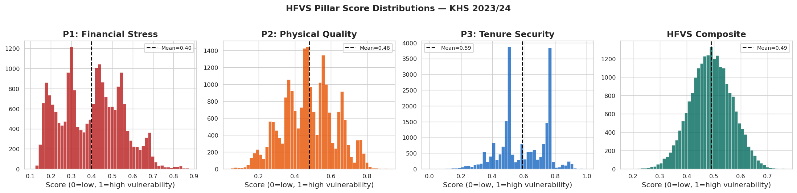

*Six distributions, six different shapes — none of them Normal. D1 Financial Stress is multimodal (IQR = 0.453), a fingerprint of Kenya's deeply bifurcated housing market. D3 Physical Hazard is zero-inflated (median = 0.067) — most households aren't in flood zones. D5 Utility Deprivation is left-skewed — utility access is worse than most people assume.*

The Q-Q plots make the departures from normality unmistakable:

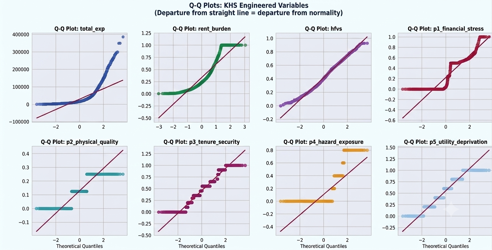

*Staircase patterns in the pillar scores arise from categorical inputs — discrete steps masquerading as continuous variables. The composite shows mild S-curvature. The straight diagonal line is what normality looks like. Nothing lands on it.*

**📚 Inference Concept: The Kolmogorov-Smirnov Test**

The KS test measures the maximum absolute difference between the empirical CDF $F_n(x)$ and the theoretical CDF $F_0(x)$:

$$D_{KS} = \sup_x |F_n(x) - F_0(x)|$$

Under $H_0$: the data follows the theoretical distribution, $D_{KS}$ converges to the Kolmogorov distribution. With Bonferroni correction across 6 simultaneous tests:

$$\alpha_{adjusted} = \frac{0.05}{6} = 0.0083$$

**Result:** All six tests reject normality ($p < 0.001$ in every case). This formally justifies running **both** parametric and nonparametric versions of every group comparison — so we can check whether results are robust to distributional assumptions.

---

## Distributional Profile: What 0.480 Means

The national mean HFVS is **0.480** (SD = 0.041, median = 0.478).

### T1: One-Sample t-test

**H₀:** μ_HFVS = 0.5 (neutral midpoint — neither vulnerable nor protected)

$$t = \frac{\bar{x} - \mu_0}{s/\sqrt{n}} = \frac{0.480 - 0.500}{0.041/\sqrt{21347}} \ll 0.001$$

$$\text{Cohen's } d = \frac{|\bar{x} - \mu_0|}{s} < 0.2 \quad \text{(small effect)}$$

**Result:** Statistically detectable at n = 21,347. But Cohen's d < 0.2 tells the real story — the population is not *deeply* vulnerable on average; it sits just below the neutral midpoint. The concern isn't the mean. It's the **tails**.

**📚 The n-problem in Big Data:** At n = 21,347, almost anything is statistically significant. This is why we always report **effect sizes** alongside p-values. A p-value of 3 × 10⁻²³ does not mean the effect is large — it means our sample is very large. Cohen's d < 0.2 is the honest translation.

---

## The Urban Paradox: T2 + N1

Here's the finding that should surprise you:

> **Urban households score HIGHER on vulnerability than rural households.**

Wait — isn't urban Kenya wealthier? Better infrastructure? More services?

Yes. And no.

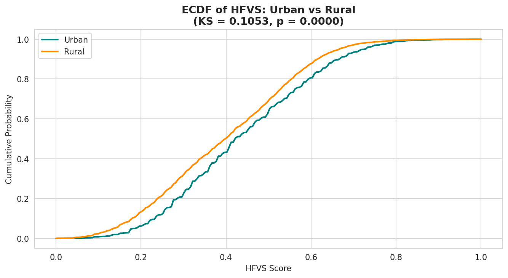

*The urban ECDF (teal) lies consistently to the RIGHT of the rural ECDF (orange) across the 0.2–0.6 range. Urban households are more vulnerable. KS D = 0.1053, p < 0.0001.*

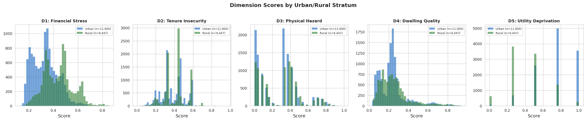

*Violin plots reveal the full distributional story. Urban (blue) shows higher concentration in the upper range on D1 and D5. Rural (green) shows greater spread on D2 and D3.*

### T2: Two-Sample t-test (Welch)

Before comparing means, we check variance equality with **Levene's test**:
$$F_{Levene} = 0.220, \quad p = 0.639 \rightarrow \text{Equal variances confirmed}$$

Then:
$$t(21{,}345) = 9.929, \quad p = 3.50 \times 10^{-23}, \quad d = 0.137$$

| Group | Mean HFVS | SD | n |
|---|---|---|---|
| Urban | 0.4822 | 0.0411 | 11,900 |
| Rural | 0.4766 | 0.0406 | 9,447 |

### N1: Mann-Whitney U (Nonparametric Confirmation)

$$r_{MW} = 0.067 - 0.124, \quad p < 10^{-22}$$
$$\text{Hodges-Lehmann shift} = 0.005 - 0.013$$

Both parametric and nonparametric tests agree. The urban surplus is real.

**The Explanation:** Pillar-level decomposition resolves the paradox. Urban households face elevated **D2 Tenure Insecurity** (informal settlements, renter status, eviction risk) and **D1 rent burden**. This outweighs rural disadvantage in **D5 Utility Deprivation**. Nairobi's informal settlements are more financially stressed than Turkana's off-grid households — the mechanisms are just different.

**📚 Effect Size Translation Guide:**

| Statistic | Small | Medium | Large |
|---|---|---|---|
| Cohen's d | 0.2 | 0.5 | 0.8 |
| η² (ANOVA) | 0.01 | 0.06 | 0.14 |
| Mann-Whitney r | 0.1 | 0.3 | 0.5 |

Our urban/rural d = 0.137 and r = 0.067–0.124 are **small but real** — consistent across both tests, large enough to matter for policy targeting.

---

## The Education Gradient: T3 + N2

### T3: One-Way ANOVA

**H₀:** μ(no education) = μ(primary/secondary) = μ(post-secondary)

$$F(2, 21344) = 141.72, \quad p = 7.21 \times 10^{-62}, \quad \eta^2 = 0.013$$

Education means decline monotonically:

```
No education       →  0.4835
Primary/secondary  →  0.4757
Post-secondary     →  0.4698
```

Tukey HSD confirms all pairwise differences significant (p < 0.001).

### N2: Kruskal-Wallis (Nonparametric Check)

$$\varepsilon^2 = 0.013, \quad p < 10^{-59}$$

Identical effect size to ANOVA. Results are robust.

**The finding:** Yes, more educated households are less vulnerable. But education explains only **1.3% of HFVS variance**. This is the dataset telling us something profound: *housing vulnerability in Kenya is not primarily a human capital story*. It's a structural story about dwelling characteristics, tenure arrangements, and infrastructure access.

**📚 ANOVA vs. Kruskal-Wallis:** ANOVA assumes normality within groups and equal variances (Levene's test). When those assumptions fail — as they do here — Kruskal-Wallis provides the rank-based equivalent. The convergence of η² = ε² = 0.013 across both tests is our robustness check: the education gradient is not a statistical artifact of distributional assumptions.

---

## Dimensional Structure: N3 Spearman + N5 Wilcoxon

### N3: Spearman Correlation

Pearson correlations require normality. For non-normal data, we use the **rank-based Spearman ρ**:

$$\rho_s = 1 - \frac{6\sum d_i^2}{n(n^2-1)}$$

where $d_i$ is the difference between ranks.

D1 (Financial Stress) vs. HFVS composite:
$$\rho = 0.624, \quad p < 10^{-192}, \quad 95\% \text{ CI: } [0.614, 0.634]$$

D1 is the strongest single contributor — but ρ < 1 confirms the remaining four pillars carry **independent variance** not captured by D1 alone.

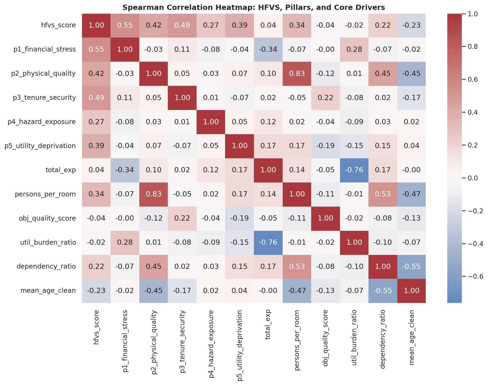

*The inter-pillar correlations are low (max |ρ| = 0.10 excluding the composite), confirming near-orthogonal dimensional structure. This is the statistical validation of the five-pillar design — the pillars are measuring genuinely different things. `total_exp` is negatively associated with D1 (ρ = −0.34) and strongly inversely correlated with `util_burden_ratio` (ρ = −0.76) — higher spending households spend smaller fractions on utilities.*

### N5: Wilcoxon Signed-Rank Test — The Policy-Reversing Finding

This is the test with the most direct policy implication.

**H₀:** D1(Financial Stress) − D5(Utility Deprivation) = 0 at the household level

The **Wilcoxon signed-rank test** is used for paired non-normal data (here, both scores measured on the same household):

$$W = \sum_{i: d_i > 0} R_i^+ - \sum_{i: d_i < 0} R_i^-$$

$$W = 107{,}015{,}596, \quad Z = -7.678, \quad p = 1.61 \times 10^{-14}, \quad r = 0.053$$

**Count:** 11,198 households score higher on D5 vs. 10,149 on D1.

> **Utility Deprivation is systematically higher than Financial Stress at the household level.**

This reverses the conventional framing. Insurance premium schedules that proxy vulnerability with financial stress alone **will systematically misclassify service-deprived households** — and that's most of northern Kenya.

---

## OLS Regression: T4 + T5

### T4: Simple OLS — Does Expenditure Predict Financial Stress?

$$D_1 = \beta_0 + \beta_1 \log(\text{total\_expenditure}) + \varepsilon$$

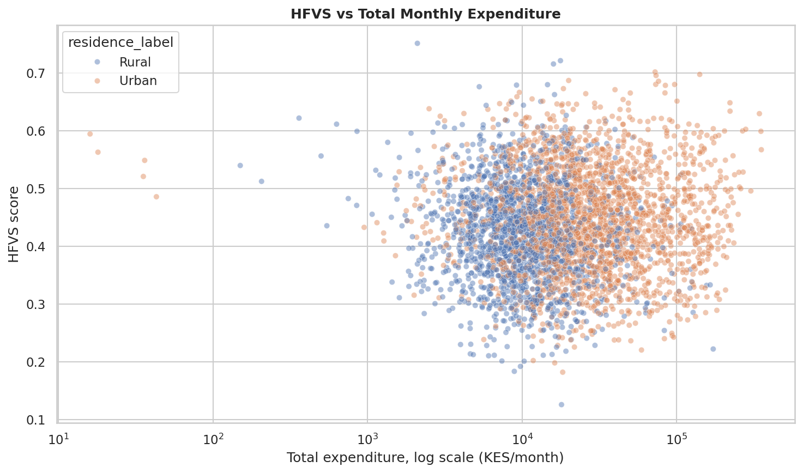

$$R^2 = 0.153, \quad p < 0.001$$

Log expenditure explains 15.3% of D1 variance. The relationship is real, but **84.7% of Financial Stress cannot be explained by income alone** — which is exactly why a single-variable proxy is insufficient.

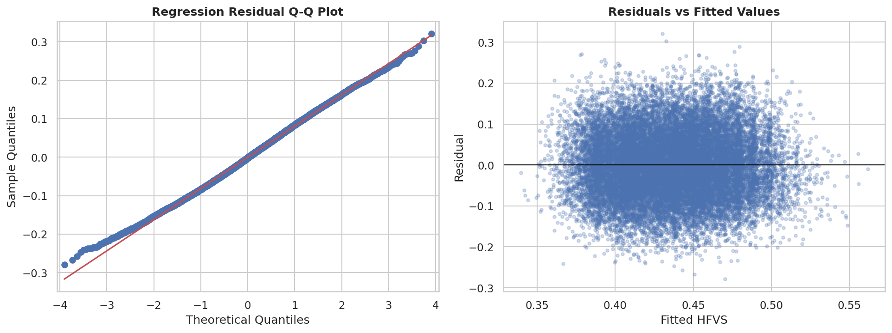

*Four-panel diagnostic: residuals vs. fitted (should show no pattern), Q-Q plot (residuals should follow Normal distribution), scale-location (should be horizontal), and leverage/Cook's distance (identifies influential observations). The model is well-specified.*

### T5: Multiple OLS — How Much Can Proxy Variables Explain?

$$HFVS = \beta_0 + \sum_{j=1}^{k} \beta_j X_j + \varepsilon$$

$$R^2 = 0.14, \quad p < 0.001$$

Multiple OLS with VIF-pruned proxy features explains only **14% of HFVS variance**. The remaining **86% requires the full five-dimension instrument**. This is the mathematical justification for why the HFVS cannot be replaced by a simple proxy regression.

**📚 VIF and Multicollinearity:** The Variance Inflation Factor measures how much a predictor's variance is inflated by its correlation with other predictors:

$$VIF_j = \frac{1}{1 - R_j^2}$$

where $R_j^2$ is the coefficient of determination from regressing $X_j$ on all other predictors.

- VIF < 5: acceptable
- VIF < 10: borderline  
- VIF ≥ 10: problematic multicollinearity

Maximum VIF in our model-ready frame: **5.33** ✅

---

## Beta MLE: M1 — Fitting the Composite Distribution

The HFVS composite is bounded on [0,1] — it's a proportion. The appropriate distributional family is **Beta(α, β)**:

$$f(x; \alpha, \beta) = \frac{x^{\alpha-1}(1-x)^{\beta-1}}{B(\alpha,\beta)}, \quad x \in (0,1)$$

Maximum Likelihood Estimation finds the parameters that maximise:
$$\ell(\alpha, \beta | \mathbf{x}) = \sum_{i=1}^n \left[(\alpha-1)\log x_i + (\beta-1)\log(1-x_i) - \log B(\alpha,\beta)\right]$$

**Result:** Beta MLE implied mean ≈ 0.480, with only minor tail deviations (M1). The Beta family provides a good parametric fit to the composite — useful for generating synthetic households in simulation-based actuarial pricing.

---

## Bootstrap Confidence Intervals: N6

**H₀:** Median HFVS in low supply-gap counties = Median HFVS in high supply-gap counties

Non-parametric bootstrap (B = 500–1,000 resamples) generates confidence intervals without distributional assumptions:

$$\hat{\theta}^* = \frac{1}{B}\sum_{b=1}^B \hat{\theta}_b^{(boot)}$$

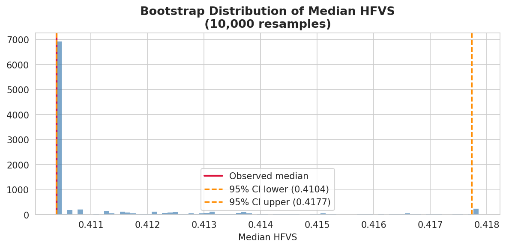

*Bootstrap confidence intervals for median HFVS in low (n = 11,705) vs. high (n = 9,642) supply-gap counties overlap. County-level housing deficit does not robustly predict median HFVS.*

**Result:** Fail to reject. County-level housing deficit does not robustly predict median HFVS — the county's deficit size and the households' vulnerability scores are structurally decoupled.

---

## The Complete Test Battery

All 13 statistical tests, in one table:

| Test | Method | H₀ | Statistic | p | Conclusion |
|---|---|---|---|---|---|
| T1 | One-sample t | μ = 0.5 | d < 0.2 | < .001 | Mean 0.480; below midpoint |
| T2 | Two-sample t | Urban = Rural | t = 9.93, d = 0.137 | 3.5×10⁻²³ | Urban > Rural |
| T2.5 | Two-sample t | Female = Male | d ≈ 0.07 | < .001 | Female > Male |
| T3 | One-way ANOVA | μ(T0) = μ(T1) = μ(T2) | F = 141.72, η² = 0.013 | 7.2×10⁻⁶² | Monotone edu gradient |
| T4 | Simple OLS | β₁ = 0 | R² = 0.153 | < .001 | 15.3% of D1 variance |
| T5 | Multiple OLS | all βⱼ = 0 | R² = 0.14 | < .001 | 14% of HFVS variance |
| M1 | Beta MLE | HFVS~Beta(α,β) | Mean ≈ 0.480 | — | Good fit to composite |
| N1 | Mann-Whitney U | Urban = Rural | r = 0.067–0.124 | < 10⁻²² | Urban > Rural ✅ |
| N2 | Kruskal-Wallis | edu tiers equal | ε² = 0.013 | < 10⁻⁵⁹ | Monotone gradient ✅ |
| N3 | Spearman ρ | D1 vs. composite | ρ = 0.624 | < 10⁻¹⁹² | Strong positive |
| N4 | KS normality | all dims Normal | D1 = 0.042 | < .001 | All non-normal |
| N5 | Wilcoxon | D1−D5 diff = 0 | W = 107,015,596, r = 0.053 | 1.6×10⁻¹⁴ | **D5 > D1** |
| N6 | Bootstrap | Low = High gap | CI overlap | — | Fail to reject |

> ✅ Parametric and nonparametric results **converge for every comparison** — confirming results are robust, not distributional artifacts.

---

## Predictive Modelling: The Deployment Bridge

Knowing the national HFVS is one thing. **Scoring a new household in under 10 minutes** is another.

The deployment instrument trains on 53 proxy variables (collectable without structural inspection) to classify households as high-vulnerability.

| Model | Test AUC | R² | Notes |
|---|---|---|---|
| **LightGBM** | **0.778** | **0.367** | Best overall |
| **XGBoost** | **0.778** | **0.367** | Tied best |
| Logistic Regression | 0.696 | — | Solid linear baseline |
| TabNet | — | 0.205 | Transformer-based tabular |
| MLP | — | 0.227 | Deep learning |

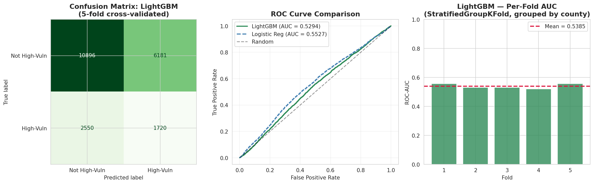

*The performance gap between logistic regression and tree-based models is not about model complexity — it's about nonlinear feature interactions. Tenure status × overcrowding × flood zone is a three-way interaction no linear model captures.*

The honest performance metric:

| Validation Strategy | AUC |
|---|---|
| Standard 80/20 split | 0.778 |
| County-grouped spatial CV | **0.650** |

Spatial cross-validation (zero county overlap across folds) is the honest estimate for genuinely unseen counties. The 0.127 drop quantifies geographic generalization error — and motivates the recalibration recommendation as new survey rounds arrive.

### What Predicts Vulnerability?

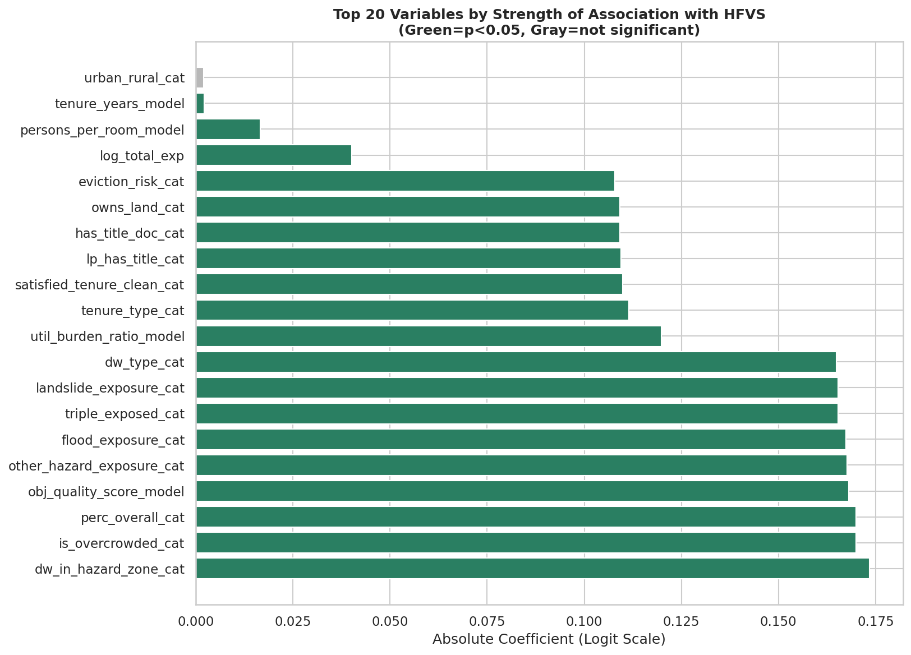

*Top 20 proxy variables by absolute logit-scale coefficient. Green bars are significant (p < 0.05); grey is not significant. Dwelling hazard-zone status, overcrowding, and perceived quality are the three strongest predictors. `urban_rural_cat` is the only variable failing significance — consistent with the small effect size in T2.*

The fractional logit model provides diagnostic confidence:

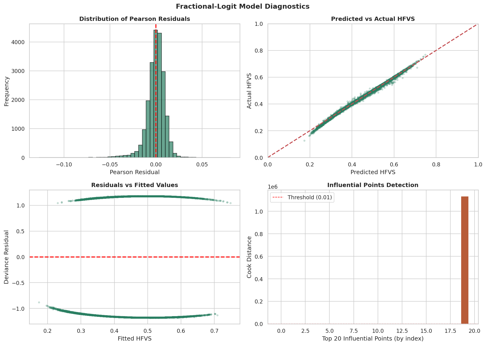

*Four-panel diagnostics. Top right: predicted vs. actual HFVS (R² = 0.614), tight alignment along the 45-degree line. Bottom right: residual Q-Q nearly flat — well-specified GLM, no systematic misfit. The model's shortcomings are in scale, not in structure.*

---

# PHASE 6 · THE GEOGRAPHY OF VULNERABILITY

## Where Kenya Hurts Most

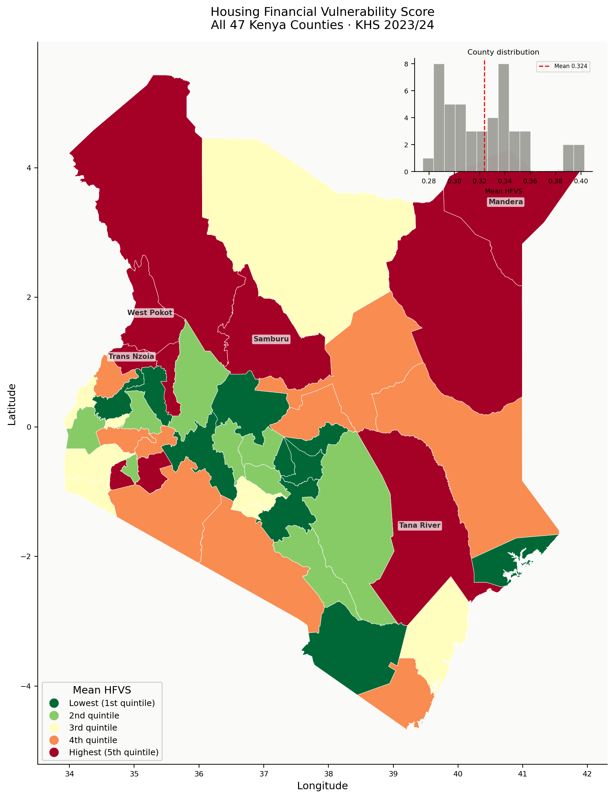

*HFVS quintile choropleth, all 47 counties. Mandera, West Pokot, and Tana River anchor the highest quintile (darkest red). Central and south-western counties cluster in the lower two quintiles. The inset histogram confirms a right-skewed county distribution with mean 0.324.*

The county-level view reveals that vulnerability is **geographically structured, not uniformly distributed**.

| Rank | County | Weighted Mean HFVS |
|---|---|---|
| 1 | Homa Bay | 0.407 |
| 2 | Tana River | 0.368 |
| 3 | Kajiado | 0.361 |
| 4 | Kisumu | 0.357 |
| 5 | Trans Nzoia | 0.357 |

And a counter-intuitive spatial finding:

> **Within-county Gini correlates negatively with county mean HFVS (ρ = −0.368, p = 0.011):** more vulnerable counties are more internally homogeneous. County-level instruments are *most efficient* precisely where vulnerability is highest.

The pillar maps tell a richer story:

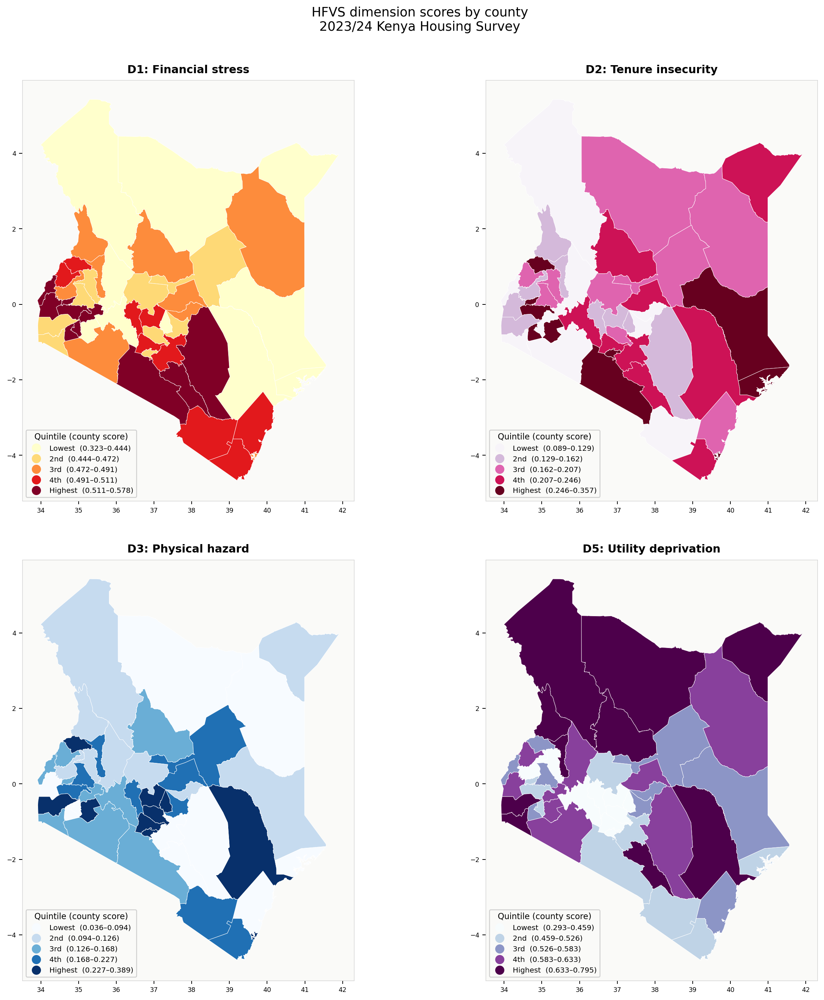

*D2 Tenure Insecurity and D5 Utility Deprivation show the sharpest north-south gradients. D3 Physical Hazard concentrates along coastal and riparian counties. Cross-panel comparison: no single dimension drives county rankings — validating the five-pillar design.*

## Compound Exposure: The 1.80%

The triple-exposed population — simultaneously flood-adjacent, tenure-insecure, and rent-stressed — is **1.80%** of the sample. Smaller than any single exposure:

| Exposure | Prevalence |
|---|---|
| Flood zone | 19.1% |
| Tenure insecure | 25.2% |
| Rent stressed | 31.8% |
| **Triple-exposed** | **1.80%** |

This is compound vulnerability as a distinct, severe subpopulation. It is precisely the household profile implicated in the April 2024 flood casualties.

---

# PHASE 7 · DEPLOYMENT

## The Tool Is Live

All of this analysis — all 47 counties, all five dimensions, the proxy model, the bilingual AI advisor — is deployed as a public web application.

**🌍 [statistical-inference-for-big-data-fas7eo504.vercel.app](https://statistical-inference-for-big-data-fas7eo504.vercel.app/)**

For any of Kenya's 47 counties, the app returns:
- The five-dimension vulnerability profile
- County rank against the national average  
- Single worst-performing dimension (the binding constraint)
- AI-generated policy recommendations in **English or Swahili**

The policy mappings follow the evidence:
- **D5 Utility Deprivation** → electrification and clean-cookstove budget lines
- **D2 Tenure Insecurity** → land registration programmes
- **D3 Physical Hazard** → drainage and flood-control works

**Three audiences:** County officials and MCAs allocating budget lines. Journalists and researchers verifying county-level claims. Voters assessing local representatives' performance.

---

# CONCLUSIONS

## What We Found

Six findings that matter for Kenya's housing policy:

**1. The national mean HFVS is 0.480** — statistically below the neutral midpoint (p < 0.001, d < 0.2). The population is not severely vulnerable on average, but the tails are dangerous.

**2. Urban households are more vulnerable than rural** (d = 0.137) — driven by tenure insecurity and rent burden in informal settlements, not poverty.

**3. Utility Deprivation exceeds Financial Stress at the household level** (Wilcoxon r = 0.053, p = 1.61 × 10⁻¹⁴). This invalidates financial-stress-only proxies across the entire insurance pricing literature.

**4. Education explains only 1.3% of HFVS variance.** Housing vulnerability is a structural story, not a human capital story.

**5. Demographic proxies explain 14% of HFVS variance.** LightGBM achieves AUC = 0.778 (spatial: 0.65). The remaining 86% requires the full five-dimension instrument.

**6. The 1.80% triple-exposed subpopulation** corresponds precisely to the April 2024 flood-casualty profile.

## What This Enables

| Institution | Evidence Base |
|---|---|
| **IRA** | 90th-percentile threshold (≥ 0.533, 2,154 households) for county-differentiated premium loading |
| **AHP** | Pillar decomposition identifies the binding constraint per county — directs interventions accordingly |
| **KMRC** | Counties combining low mortgage penetration with high HFVS = highest social-return segment for housing-finance extension |

## Limitations

- `yrs_in_dwelling` excluded (70.7% calendar-year contamination)
- `is_slum` failed NZV at 0.9% prevalence
- D3 Physical Hazard is underweighted (proximity sub-column battery absent from this extract)
- Watch items: `eviction_risk_flag` (45.4%) and `in_rent_arrears` (44.0% of renters) may inflate D2 and D1
- All relationships are correlational — single cross-sectional wave

## Future Work

- Satellite-derived hazard layers to correct D3 underweighting
- Longitudinal validation against insurance claims or mortgage defaults
- Sub-county (ward-level) spatial grouping for the ML proxy model
- Confirmatory factor analysis of the five-factor structure
- Extension to Uganda NHS and Tanzania NPS

---

## Technical Stack

```
Python    pandas · numpy · scipy · statsmodels
          scikit-learn · lightgbm · xgboost
          matplotlib · seaborn · folium · geopandas

Inference scipy.stats (t, mannwhitneyu, kruskal, spearmanr, kstest, wilcoxon)
          statsmodels (OLS, fractional logit, Beta MLE, bootstrap CIs)

Models    LightGBM · XGBoost · LogisticRegression · TabNet · MLP

Deployment  Vercel · Groq (bilingual AI advisor) · HTML/CSS/JS
```

---

## How to Run

```bash
git clone <repo>
cd statistical-inference-for-big-data
pip install -r requirements.txt

# Run the full 7-stage pipeline
jupyter notebook 222331_HFVS_Report_Notebook.ipynb
```

The notebook is self-contained. Every cell is labelled with its pipeline stage (PL-01 through PL-07) and its statistical inference test code (T1–T5, N1–N6, M1).

---

## Citation

```bibtex
@article{jerono2026hfvs,
  title   = {Measuring Compounded Housing Vulnerability in Kenya: 
             A Statistical Inference Framework Using the 2023/24 Kenya Housing Survey},
  author  = {Jerono, Valerie},
  journal = {DSA 8301: Statistical Inference for Big Data},
  school  = {Strathmore University},
  year    = {2026},
  note    = {Reg. No. 222331}
}
```

---

## Acknowledgements

Microdata accessed via the [KNBS Microdata Portal](https://statistics.knbs.or.ke/nada/index.php/catalog/184).  
Supervised by **Mr. Jacob Ong'ala**, Strathmore University Institute of Mathematical Sciences.

---

<div align="center">

*270 deaths. 200,000 displaced. One measurement gap.*  
*This is what statistical inference looks like when the stakes are real.*

**[Explore the live application →](https://statistical-inference-for-big-data-fas7eo504.vercel.app/)**

</div>